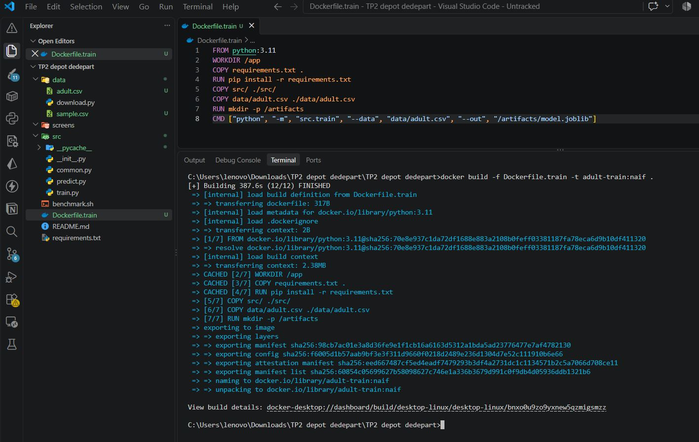
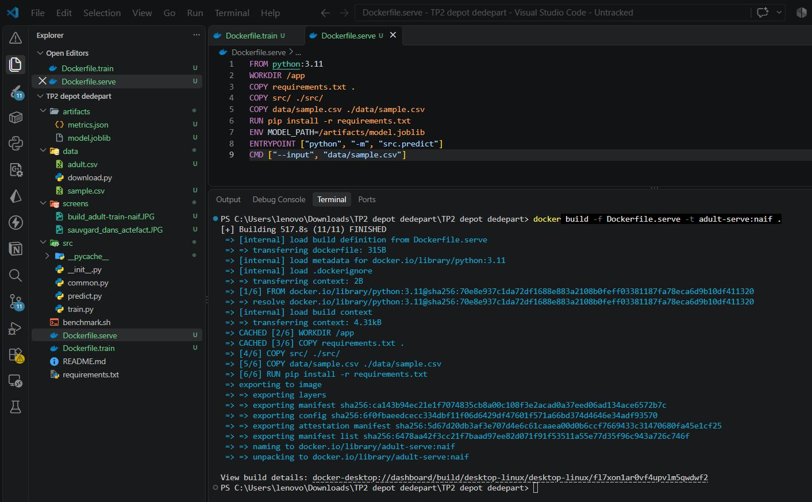
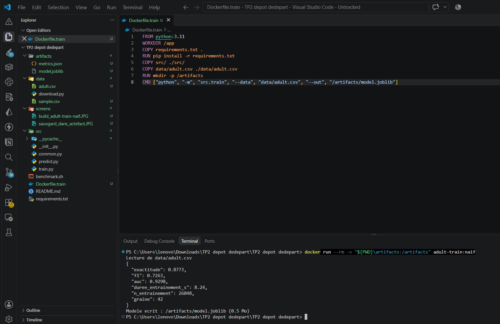
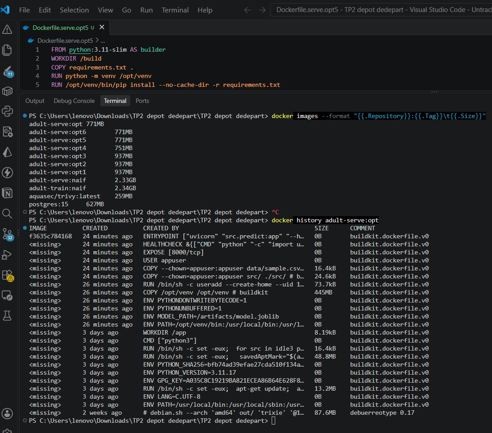
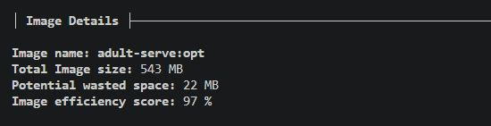

<div align="center">

# Conteneuriser un modèle et optimiser son image

[](rapport-tp2.pdf)
[](https://www.docker.com/)
[](trivy.checks.txt)

</div>

---

## Résumé

Ce TP prend un classifieur de revenus (**Adult Income**, UCI) développé en
scikit-learn et le livre sous forme d'image Docker de production : entraînement
et inférence conteneurisés séparés, image optimisée et mesurée pas à pas,
exécution non-root, sondes de santé, analyse de vulnérabilités.

| Indicateur | Avant | Après | Gain |
| --- | --- | --- | --- |
| **Taille de l'image** | 624 Mo | **176 Mo** | **−71,8 %** |
| **Temps de reconstruction** | 106 s | **14 s** | **÷ 7,6** |
| Vulnérabilités Trivy | — | 192 détectées (0 critical) | analyse §4.2 |

**Performances du modèle** — exactitude 0,8773 · F1 0,7263 · AUC 0,9298 ·
entraînement 8,24 s sur 26 048 individus, graine 42
([`artifacts/metrics.json`](artifacts/metrics.json)).

---

## Table des matières

1. [Introduction](#1-introduction)
2. [Le projet : chaîne de traitement et implémentation](#2-le-projet--chaîne-de-traitement-et-implémentation)
3. [Axe I — Conteneuriser un modèle IA](#3-axe-i--conteneuriser-un-modèle-ia)
   - [3.1 Version naïve](#31-version-naïve--le-point-de-référence)
   - [3.2 Les six optimisations](#32-les-six-optimisations)
   - [3.3 Tableau de synthèse](#33-tableau-de-synthèse-des-mesures)
   - [3.4 Réponses aux trois questions du support](#34-réponses-aux-trois-questions-du-support)
4. [Axe II — Orchestrer et sécuriser](#4-axe-ii--orchestrer-et-sécuriser)
5. [Conclusion](#5-conclusion)
6. [Démarrage rapide](#6-démarrage-rapide)
7. [Structure du dépôt](#7-structure-du-dépôt)

---

## 1. Introduction

### 1.1 Contexte

Ce rapport présente le travail réalisé dans le cadre du **TP 2** du cours
*Cloud Computing & Déploiement IA*. Nous travaillons sur un modèle de
classification des revenus basé sur le jeu **Adult Income (UCI)** et développé
avec **scikit-learn**. L'objectif est de conteneuriser le modèle avec **Docker**,
puis d'optimiser et de sécuriser son image.

Les objectifs principaux sont :

- conteneuriser l'entraînement et l'inférence du modèle ;
- optimiser la taille de l'image Docker et mesurer les temps de construction ;
- utiliser **Docker Compose** pour gérer plusieurs conteneurs avec un volume partagé ;
- analyser les vulnérabilités de l'image avec **Trivy** et les corriger.

### 1.2 Prérequis et environnement de travail

| Élément | Vérification / valeur |
| --- | --- |
| Docker | 28.5.1 (build e180ab8) |
| Docker Compose | v2 (plugin) |
| Trivy | installé, base de règles `debian 13.7` |
| Base naïve | `python:3.11` |
| Base optimisée | `python:3.11-slim` |
| Python local (hors conteneur) | 3.12.10 |
| OS hôte | Windows 11, Docker Desktop (moteur Linux) |
| Données | `data/adult.csv` — 32 561 lignes (UCI Adult réel) |

---

## 2. Le projet : chaîne de traitement et implémentation

### 2.1 Arborescence du dépôt

| Fichier / répertoire | Rôle |
| --- | --- |
| `src/train.py` | Entraînement, évaluation, sérialisation du pipeline |
| `src/predict.py` | Inférence : mode lot (CLI) et mode service (FastAPI) |
| `src/common.py` | `ColumnTransformer` partagé entre les deux |
| `data/download.py` | Récupération UCI ou génération hors ligne |
| `requirements.txt` | Dépendances Python épinglées |
| `Dockerfile.train` | Image d'entraînement |
| `Dockerfile.serve` | Image d'inférence naïve |
| `Dockerfile.serve.opt1 … opt6` | Une optimisation par fichier |
| `Dockerfile.serve.opt` | Image finale |
| `benchmark.sh` | Mesure automatisée des trois indicateurs |
| `.dockerignore` | Réduction du contexte de construction |
| `mesure-results.txt` | Relevé des 8 mesures |
| `trivy.checks.txt` | Rapport Trivy de l'image finale |
| `screens/` | 13 captures de démonstration |

**Point d'architecture.** Le découpage de `src/common.py` est le plus
important : ce module est importé *à la fois* par l'entraînement et par
l'inférence — c'est ce qui évite l'écart entre la préparation des données à
l'entraînement et en production. Le prétraitement (imputation, mise à l'échelle,
encodage one-hot) n'est pas écrit deux fois : il est *objet de pipeline*, donc
sérialisé *avec* le modèle dans `model.joblib`. Une transformation ajoutée en
production sans être répliquée à l'entraînement est une source classique de
*drift* silencieux ; le `ColumnTransformer` partagé l'élimine par construction.

### 2.2 Le jeu de données

`data/download.py` tente un téléchargement depuis l'archive UCI et bascule
automatiquement sur un générateur synthétique en cas d'échec réseau, ce qui rend
le TP réalisable en salle isolée. Le téléchargement a abouti :
**32 561 lignes** correspondant au jeu UCI *Adult Income* authentique.

| Classe | Effectif | Fréquence |
| --- | ---: | ---: |
| `<=50K` | 24 720 | 75,92 % |
| `>50K` | 7 841 | 24,08 % |
| **Total** | **32 561** | **100 %** |

Le déséquilibre de classe (24 % de positifs) rend l'exactitude seule trompeuse,
ce qui justifie le recours simultané au F1 et à l'AUC.

### 2.3 Entraînement : `src/train.py`

Découpage **stratifié** (`stratify=y`) et graine fixée à 42 : l'expérience est
reproductible. Avec `test_size=0.2`, on obtient **26 048** entraînement /
6 513 test.

| Bloc | Contenu |
| --- | --- |
| Prétraitement num. | `SimpleImputer(median)` puis `StandardScaler` sur 5 colonnes |
| Prétraitement cat. | `SimpleImputer(most_frequent)` puis `OneHotEncoder(handle_unknown="ignore", sparse_output=False)` sur 5 colonnes |
| Modèle | `HistGradientBoostingClassifier(max_iter=200, random_state=42)` |

| Métrique | Valeur |
| --- | ---: |
| Exactitude (accuracy) | 0,8773 |
| F1 (classe positive) | 0,7263 |
| AUC-ROC | 0,9298 |
| Durée d'entraînement | 8,24 s |
| Individus en entraînement | 26 048 |
| Graine | 42 |

L'AUC de 0,93 indique un excellent pouvoir de discrimination. L'exactitude de
0,877 est en revanche *modeste* pour Adult Income (les références publiées
dépassent 0,90) : seules 10 variables sur 15 sont retenues dans
`src/common.py` — `fnlwgt`, `education`, `race` et `native_country` sont
écartées, et `fnlwgt` est la variable la plus informative du jeu.

### 2.4 Inférence : `src/predict.py`

Deux modes, comme le demande le support :

- **mode lot** : `python -m src.predict --input data/sample.csv`
- **mode service** : `uvicorn src.predict:app`

| Route | Sémantique | Équivalent Kubernetes |
| --- | --- | --- |
| `GET /health` | Sonde de vivacité : le processus répond-il ? | `livenessProbe` |
| `GET /ready` | Sonde de disponibilité : le modèle est-il chargé ? | `readinessProbe` |
| `POST /v1/predict` | Prédiction sur un individu validé par Pydantic | Service applicatif |

Le chargement du modèle est **paresseux** (lazy loading) ; le code en reconnaît
lui-même la limite pour la production. Deux points de qualité sont à souligner :
le modèle Pydantic `Individu` valide les plages numériques (`age` 17–100,
`education_num` 1–16, `hours_per_week` 1–99), et la réponse inclut la
`latence_ms` mesurée autour de `predict_proba`.

### 2.5 Le script de mesure : `benchmark.sh`

Le script applique une séquence méthodologiquement importante : il mesure
*d'abord* la construction à froid avec `--no-cache`, puis *ensuite* la
reconstruction après modification. L'ordre inverse aurait été faux : sans le
passage préalable en `--no-cache`, le cache serait déjà partiellement peuplé et
la mesure « à froid » n'aurait plus de sens.

```bash
T_FROID=$(( $(date +%s) - T0 ))          # docker build --no-cache
echo "# touche par benchmark.sh $(date +%s)" >> src/predict.py
T0=$(date +%s)
docker build -f "${DOCKERFILE}" -t "${IMAGE}" . >/dev/null
T_CHAUD=$(( $(date +%s) - T0 ))          # reconstruction
sed -i '$ d' src/predict.py              # nettoyage
TAILLE=$(docker image inspect "${IMAGE}" --format '{{.Size}}')
```

> **Comment lire les sections qui suivent.** Chaque étape suit le même plan : la
> commande, le `Dockerfile` correspondant, la mesure relevée, puis la **capture
> d'écran** de la manipulation. Les captures sont insérées à l'emplacement exact
> de l'étape qu'elles documentent — il n'y a pas d'annexe à consulter
> séparément.

---

## 3. Axe I — Conteneuriser un modèle IA

### 3.1 Version naïve : le point de référence

L'image naïve est construite sur `python:3.11`, l'image officielle complète,
qui embarque toute la chaîne d'outils Debian : compilateur, documentation,
outils système.

```dockerfile
FROM python:3.11
WORKDIR /app
COPY requirements.txt .
RUN pip install -r requirements.txt
COPY src/ ./src/
COPY data/adult.csv ./data/adult.csv
RUN mkdir -p /artifacts
CMD ["python", "-m", "src.train",
     "--data", "data/adult.csv",
     "--out", "/artifacts/model.joblib"]
```

**Construction de l'image d'entraînement naïve**



```dockerfile
FROM python:3.11
WORKDIR /app
COPY requirements.txt .
COPY src/ ./src/
COPY data/sample.csv ./data/sample.csv
RUN pip install -r requirements.txt
ENV MODEL_PATH=/artifacts/model.joblib
ENTRYPOINT ["python", "-m", "src.predict"]
CMD ["--input", "data/sample.csv"]
```

**Construction de l'image d'inférence naïve**



> **Défaut structurel de la version naïve.** L'ordre des instructions est le
> point critique. `COPY src/` est exécuté *avant* `RUN pip install`. Or le cache
> invalide une couche dès que l'instruction **ou ses entrées** changent. Toute
> modification d'une ligne de `src/predict.py` invalide donc `COPY src/` *et
> toutes les couches suivantes*, ce qui impose de rejouer l'installation complète
> de numpy, scipy, pandas et scikit-learn. C'est la réponse à la question 1 du
> support, mesurable : **106 s** de reconstruction.

`Dockerfile.train` ne souffre pas de ce défaut : il respecte déjà l'ordre
`requirements.txt` → `pip install` → `src/`. L'antipattern n'a été introduit que
dans l'image de service.

**Sauvegarde des artefacts**

```bash
docker build -f Dockerfile.train -t adult-train:naif .
docker run --rm -v $(pwd)/artifacts:/artifacts adult-train:naif
ls -lh artifacts/model.joblib
bash benchmark.sh naif Dockerfile.serve      # -> 624 Mo
```




### 3.2 Les six optimisations

#### Optimisation 1 — base `python:3.11-slim`

```dockerfile
FROM python:3.11-slim          # au lieu de python:3.11
```

Le support justifie le choix de `slim` plutôt qu'`alpine` : avec la libc musl,
numpy et scikit-learn devraient être recompilés depuis les sources. Les wheels
*manylinux* sont construits contre glibc, pas musl.


#### Optimisation 2 — ordonnancement des `COPY`

```dockerfile
FROM python:3.11-slim
WORKDIR /app
COPY requirements.txt .              # <- isole la couche "dépendances"
RUN pip install -r requirements.txt   # <- le cache survit aux modifications de src/
COPY src/ ./src/                     # <- invalidé souvent, mais peu coûteux
COPY data/sample.csv ./data/sample.csv
ENV MODEL_PATH=/artifacts/model.joblib
ENTRYPOINT ["python", "-m", "src.predict"]
CMD ["--input", "data/sample.csv"]
```

C'est l'optimisation la plus importante du TP pour le temps d'itération : elle
ne change **rien** à la taille de l'image mais divise la reconstruction par près
de neuf.


#### Optimisation 3 — `.dockerignore`

Le fichier exclut du contexte de construction les éléments inutiles :
`venv/`, `.git/`, `__pycache__/`, `artifacts/`, `*.pdf`, etc.

> **Précision indispensable.** Un `.dockerignore` **ne modifie jamais la taille
> de l'image**. Il réduit le *contexte de construction*, c'est-à-dire les données
> transmises au démon Docker. Son effet est visible sur le temps de construction
> et sur le risque de fuite de secrets, mais pas sur `docker images`. Les mesures
> le confirment : la taille reste rigoureusement identique à l'optimisation 2
> (263 Mo avant comme après).


#### Optimisation 4 — `pip install --no-cache-dir`

```dockerfile
RUN pip install --no-cache-dir -r requirements.txt
```

Par défaut, pip conserve les wheels téléchargés dans `~/.cache/pip`. Comme ces
fichiers sont créés *dans* la couche `RUN`, ils sont figés dans l'image et jamais
nettoyés : c'est du poids mort.

C'est la seconde optimisation la plus rentable en taille : **263 Mo → 172 Mo,
soit −91 Mo**, qui correspond exactement au poids du cache pip figé.


#### Optimisation 5 — construction multi-étapes

```dockerfile
FROM python:3.11-slim AS builder
WORKDIR /build
COPY requirements.txt .
RUN python -m venv /opt/venv
RUN /opt/venv/bin/pip install --no-cache-dir -r requirements.txt

FROM python:3.11-slim
WORKDIR /app
ENV PATH="/opt/venv/bin:$PATH"
COPY --from=builder /opt/venv /opt/venv   # seul le résultat est livré
COPY src/ ./src/
COPY data/sample.csv ./data/sample.csv
ENTRYPOINT ["python", "-m", "src.predict"]
CMD ["--input", "data/sample.csv"]
```

L'image `builder` contient les outils de compilation (gcc, headers) ; l'image
finale n'en copie que le résultat via `COPY --from=builder`, de sorte que la
chaîne d'outils n'est jamais livrée.


#### Optimisation 6 — utilisateur non-root et `HEALTHCHECK`

```dockerfile
RUN useradd --create-home --uid 10001 appuser \
    && mkdir -p /artifacts \
    && chown appuser:appuser /artifacts
COPY --chown=appuser:appuser src/ ./src/
COPY --chown=appuser:appuser data/sample.csv ./data/sample.csv
USER appuser
EXPOSE 8000
HEALTHCHECK --interval=15s --timeout=5s --start-period=20s --retries=3 \
  CMD ["python", "-c", "import urllib.request; \
        urllib.request.urlopen('http://127.0.0.1:8000/health', timeout=3)"]
ENTRYPOINT ["uvicorn", "src.predict:app", "--host", "0.0.0.0", "--port", "8000"]
```

C'est l'optimisation la plus structurante pour le TP 3 :

1. **Utilisateur non-root** (`appuser`, UID 10001) : réduit fortement la surface
   d'attaque, correspond au `securityContext` standard de Kubernetes ;
2. **UID fixe** plutôt qu'alloué dynamiquement : évite toute collision avec un
   utilisateur existant sur le nœud hôte ;
3. **Ownership explicite par `--chown`** : fichiers lisibles par `appuser`, sans
   `chmod` global qui créerait une couche supplémentaire ;
4. **`ENTRYPOINT` en forme exec** (tableau JSON) : `uvicorn` devient le PID 1 et
   reçoit directement les `SIGTERM` de l'orchestrateur — condition indispensable
   pour un arrêt propre sur Kubernetes.


### 3.3 Tableau de synthèse des mesures

Les huit mesures de [`mesure-results.txt`](mesure-results.txt). *Δ taille* et
*Δ recons.* donnent l'écart par rapport à l'étape précédente.

| # | Optimisation | Taille | Build à froid | Rebuild | Δ taille | Δ recons. |
| :-: | --- | ---: | ---: | ---: | ---: | ---: |
| 0 | Version naïve (référence) | 624 Mo | 112 s | 106 s | — | — |
| 1 | Base `python:3.11-slim` | 263 Mo | 108 s | 130 s | −361 | +24 |
| 2 | `COPY requirements.txt` avant `src/` | 263 Mo | 159 s | 15 s | 0 | −115 |
| 3 | `.dockerignore` complet | 263 Mo | 678 s | 5 s | 0 | −10 |
| 4 | `pip install --no-cache-dir` | 172 Mo | 154 s | 16 s | −91 | +11 |
| 5 | Construction multi-étapes | 176 Mo | 208 s | 18 s | +4 | +2 |
| 6 | Non-root + `HEALTHCHECK` | 176 Mo | 253 s | 30 s | 0 | +12 |
| | **Image finale `adult-serve:opt`** | **176 Mo** | **171 s** | **14 s** | | |



### 3.4 Réponses aux trois questions du support

#### Question 1 — Pourquoi la reconstruction est-elle presque égale à la construction à froid ?

La reconstruction prend **106 s** contre **112 s** à froid, soit un rapport de
**95 %**. La raison est l'**invalidation en cascade** des couches : le cache rejoue
une couche si l'instruction *et ses entrées* sont inchangées ; dès qu'une couche
est invalidée, toutes les couches suivantes sont reconstruites.

Dans `Dockerfile.serve`, l'ordre est `COPY src/` puis `RUN pip install`. La
modification de `src/predict.py` invalide `COPY src/` donc aussi `pip install`.
Le démon doit retélécharger et réextraire l'intégralité des dépendances — soit le
même travail qu'une construction à froid. Celle-ci n'est que 6 s plus rapide car
elle réutilise le cache local des images de base déjà téléchargées.

#### Question 2 — Quelle optimisation apporte le plus gros gain ?

**Gain de taille.** L'optimisation 1 (`slim`) apporte le plus gros gain :
**−361 Mo (−57,9 %)**, soit **80,6 %** de la réduction totale obtenue
(361/448). L'optimisation 4 (`--no-cache-dir`) vient en second avec **−91 Mo**,
soit 20,3 % du gain total. Bilan global : **624 Mo → 176 Mo, soit −71,8 %**.

**Gain de temps de reconstruction.** L'optimisation 2 (ordonnancement des `COPY`)
apporte le gain le plus important : **130 s → 15 s, soit −115 s (−88,5 %)**. Par
rapport au naïf, on passe de 106 s à 15 s, une **division par 7**.

**Pourquoi ce ne sont pas les mêmes ?** Les deux gains reposent sur des
mécanismes physiques distincts :

- le **gain de taille** dépend du **contenu** de l'image : déterminé dès
  l'instruction `FROM` (choix de la distribution) et par les artefacts laissés
  derrière les `RUN` (cache pip). C'est une propriété *du contenu* ;
- le **gain de reconstruction** dépend de l'**ordre** des instructions, donc de la
  topologie du graphe de couches. Deux images de taille identique peuvent avoir
  des temps de reconstruction très différents.

Ces deux axes sont **orthogonaux** : une optimisation peut être neutre en taille
mais décisive en temps (opt 2 : 0 Mo, −115 s), ou l'inverse (opt 5 : +4 Mo,
+54 s à froid).

#### Question 3 — Analyse avec `dive`

```bash
dive adult-serve:opt
```



**Score d'efficacité `dive` : 97 / 100**

Concernant la couche la plus gourmande, deux candidats :

1. **Dans l'image naïve**, la couche `RUN pip install -r requirements.txt` est de
   loin la plus lourde : elle contient à la fois les dépendances *et* le cache pip
   figé (91 Mo). Gaspillée à double titre — le cache ne sert jamais à l'exécution,
   et cette couche est invalidée à chaque modification du code source.
2. **Dans l'image finale**, la couche `COPY --from=builder /opt/venv /opt/venv`
   est la plus volumineuse. Elle est légitime en contenu, mais le venv embarque
   son propre `pip`, `setuptools` et `wheel`, qui font doublon avec l'image de
   base. Le rapport Trivy confirme cette duplication.

---

## 4. Axe II — Orchestrer et sécuriser

### 4.1 Orchestration avec Docker Compose

**Constat.** Le support impose dans l'arborescence un fichier
`docker-compose.yml` dont le but est explicite : « orchestrer deux conteneurs
avec un volume partagé ». **Ce fichier est absent** du dépôt.

**Proposition.** Le fichier suivant orchestre l'entraînement puis l'inférence,
avec un volume nommé partagé pour transporter le modèle entre les deux étapes :

```yaml
services:
  train:
    build:
      context: .
      dockerfile: Dockerfile.train
    image: adult-train:opt
    volumes:
      - artifacts:/artifacts          # le modèle est écrit ici
    environment:
      N_ESTIMATORS: "200"
      RANDOM_SEED: "42"
    command: ["python","-m","src.train",
              "--data","data/adult.csv",
              "--out","/artifacts/model.joblib"]

  serve:
    build:
      context: .
      dockerfile: Dockerfile.serve.opt
    image: adult-serve:opt
    depends_on:
      train:
        condition: service_completed_successfully   # Compose v2
    ports:
      - "8000:8000"
    environment:
      MODEL_PATH: /artifacts/model.joblib
    volumes:
      - artifacts:/artifacts:ro       # lecture seule
    healthcheck:
      test: ["CMD","python","-c","import urllib.request,sys; \
        sys.exit(0 if urllib.request.urlopen(\
        'http://127.0.0.1:8000/ready',timeout=3).status==200 else 1)"]
      interval: 15s
      timeout: 5s
      start_period: 20s
      retries: 3
    restart: unless-stopped

volumes:
  artifacts:
```

**Justification de `service_completed_successfully`.** Un `depends_on` simple ne
garantit que le *démarrage* du conteneur `serve`, pas que le modèle existe déjà.
Or `src/predict.py` lève une `FileNotFoundError` si `MODEL_PATH` est absent : sans
cette condition, l'inférence démarrerait avant la fin de l'entraînement et
échouerait. Elle n'est disponible que dans Docker Compose v2. Le montage `:ro`
renforce la sécurité : le service `serve` ne peut pas altérer le modèle.

> **Limite permissions.** Le conteneur `train` s'exécute en `root` et écrit
> `model.joblib` avec l'UID 0. Le service `serve` (`appuser`, UID 10001) peut le
> lire — les fichiers créés par `joblib.dump` ont les permissions 644 — mais ne
> pourrait pas l'écrire. C'est souhaitable ici.

### 4.2 Analyse de vulnérabilités avec Trivy

```bash
trivy image adult-serve:opt
```

Rapport complet : [`trivy.checks.txt`](trivy.checks.txt).

**Résultats globaux.** Sur l'image finale `adult-serve:opt` (base `debian 13.7`),
**192 vulnérabilités** au total :

| Famille | Total | Critical | High | Medium | Low |
| --- | ---: | ---: | ---: | ---: | ---: |
| Debian (paquets système) | 167 | 0 | 45 | 59 | 61 |
| Python (paquets `pip`) | 25 | 0 | 7 | 15 | 3 |
| **Total** | **192** | **0** | **52** | **74** | **64** |


**Vulnérabilités Python.**

| Paquet | Version | CVEs | Sév. max | Version corrigée |
| --- | ---: | ---: | --- | --- |
| `starlette` | 0.41.3 | 7 | HIGH | 1.3.1 |
| `pip` | 24.0 | 6 | MEDIUM | 26.2.0 |
| `setuptools` | 79.0.1 | 1 | MEDIUM | 83.0.0 |
| `wheel` | 0.45.1 | 1 | HIGH | 0.46.2 |
| `jaraco.context` | 5.3.0 | 1 | HIGH | 6.1.0 |

> **Cause racine identifiée : le *pinning* de FastAPI.** La vulnérabilité la plus
> grave côté Python, `CVE-2025-62727` (*Starlette DoS via Range header merging*,
> HIGH), est **structurellement incorrigible** en l'état : `requirements.txt`
> épingle `fastapi==0.115.5`, dont la métadonnée impose
> `starlette>=0.40.0,<0.42.0`, alors que la version corrigée est `0.49.1`.
> Correction : passer à `fastapi>=0.121`, qui autorise `starlette>=0.46.0`.

**Vulnérabilités Debian.**

| Paquet | CVEs | Nature de la vulnérabilité |
| --- | ---: | --- |
| `glibc` | 21 | débordements de tampon, DoS, élévation de privilèges |
| `util-linux` | 6 | privilege escalation via `X-mount` |
| `systemd` | 7 | élévation de privilèges locale (`systemd-homed`) |
| `tar` | 5 | TOCTOU, injection de fichiers cachés |
| `perl` | 5 | exécution de code, DoS |
| `sqlite3` | 4 | DoS, divulgation d'information |
| `coreutils` | 4 | courses, DoS |
| `ncurses` | 2 | débordement de tampon |
| `libpcre2` | 1 | écriture hors limites |

> **Duplication des alertes : un signal trompeur.** Une même CVE de `glibc`
> apparaît pour `libc-bin` *et* `libc6`, deux paquets binaires du même paquet
> source. Les 6 CVE `util-linux` sont comptées pour 9 paquets. Le décompte manuel
> des CVE *distinctes* donne environ **72 à 73 identifiants uniques**, contre 167
> signalements. Un rapport Trivy doit toujours être désagrégé avant d'être priorisé.

**Plan de remédiation** (par ordre impact/effort) :

1. **Mettre à jour la base système** — traite la quasi-totalité des 167 alertes Debian :
   ```dockerfile
   RUN apt-get update \
    && apt-get upgrade -y \
    && apt-get clean \
    && rm -rf /var/lib/apt/lists/*
   ```
2. **Supprimer les paquets de construction** de l'image finale — élimine 9 des 25
   alertes Python et réduit la taille :
   ```dockerfile
   RUN /opt/venv/bin/pip uninstall -y pip setuptools wheel
   ```
3. **Mettre à jour `requirements.txt`** — correction de la cause racine :
   ```
   fastapi>=0.121              # au lieu de ==0.115.5
   uvicorn[standard]>=0.32.1
   pydantic>=2.10.3
   starlette>=1.3.1            # corrige CVE-2025-62727 (HIGH)
   ```
4. **Adopter une base distroless** (sans gestionnaire de paquets) — supprime
   `glibc`, `systemd`, `perl`, `tar`, `sqlite3` de l'image finale et ramène le
   compte à quelques unités. Prépare directement le TP 3.

**Effet attendu**

| Indicateur | Avant | Après | Réduction |
| --- | ---: | ---: | ---: |
| Taille de l'image | 176 Mo | 130–140 Mo | ~−20 % |
| Vulnérabilités Debian | 167 | 0 | −100 % |
| Vulnérabilités Python | 25 | 0 | −100 % |
| Vulnérabilités HIGH | 52 | 0 | −100 % |

---

## 5. Conclusion

Ce TP avait pour objectif de conteneuriser un modèle d'intelligence artificielle
et d'optimiser son image de manière mesurée. Les résultats obtenus sont
convergents.

**Sur le plan de la taille**, l'image est passée de **624 Mo à 176 Mo, soit une
réduction de 71,8 %**, obtenue pour l'essentiel par deux optimisations
indépendantes : le choix d'une base `slim` (−361 Mo, 80,6 % du gain total) et
l'ajout de `--no-cache-dir` (−91 Mo, soit 51,7 % de la taille de l'image
finale). Cette dernière valeur est l'illustration la plus parlante du
gaspillage classique en conteneurs.

**Sur le plan de l'itération**, le temps de reconstruction après modification du
code est passé de **106 s à 14 s, soit une division par 7,6**. Ce gain, entièrement
dû à l'ordonnancement des instructions `COPY`, est autrement plus précieux en
pratique quotidienne : c'est lui qui rend la boucle « modifier — rebuild —
tester » utilisable. Cette différence de mécanisme — la taille dépend du
**contenu** de l'image, le temps de reconstruction de la **topologie** du graphe
de couches — constitue la réponse à la question 2 du support et la leçon
principale du TP.

**L'image finale est prête pour Kubernetes** : utilisateur non-root, sondes
`/health` et `/ready` distinctes, `ENTRYPOINT` en forme exec et `EXPOSE`.
L'optimisation 6 correspond exactement aux `securityContext` et aux sondes du
TP 3.

**L'analyse Trivy a mis en évidence un résultat contre-intuitif** : sur les 192
vulnérabilités détectées, la grande majorité sont des doublons. Le décompte brut
de 167 alertes Debian ne correspond qu'à environ 73 CVE distinctes. Et la
vulnérabilité Python la plus grave est structurellement incorrigible en l'état :
identifier une *cause racine* dans les métadonnées de dépendances plutôt que de
se contenter d'une mise à jour aveugle est la compétence mise en œuvre ici.

**Trois écarts subsistent** et constituent la suite naturelle du travail :
l'orchestration Compose n'est pas implémentée alors qu'elle fait partie de
l'Axe II ; aucune remédiation n'a été appliquée aux vulnérabilités identifiées ;
et la mesure du temps de construction de l'optimisation 3 (678 s) doit être
rejouée, cette valeur étant cohérente avec aucune autre mesure du tableau.

---

## 6. Démarrage rapide

### Prérequis

- Docker 28.5.1 (avec BuildKit)
- Docker Compose v2 (orchestration)
- Trivy (analyse de vulnérabilités)
- Python 3.11+ uniquement si vous voulez entraîner hors conteneur

### Construire, entraîner, servir

```bash
# 1. Image d'entraînement
docker build -f Dockerfile.train -t adult-train .

# 2. Entraînement : produit artifacts/model.joblib
docker run --rm -v "$PWD/artifacts:/artifacts" adult-train

# 3. Image de service (variante finale)
docker build -f Dockerfile.serve.opt6 -t adult-serve:opt .

# 4. Lancement de l'API
docker run -d --name adult-serve -p 8000:8000 \
  -v "$PWD/artifacts:/artifacts:ro" adult-serve:opt

# 5. Vérification
curl http://127.0.0.1:8000/health
curl http://127.0.0.1:8000/ready
curl -X POST http://127.0.0.1:8000/v1/predict \
  -H "Content-Type: application/json" \
  -d '{"age": 39, "education_num": 13, "hours_per_week": 40}'
```

### Mode lot

```bash
python -m src.predict --input data/sample.csv
```

### Reproduire les mesures

```bash
bash benchmark.sh naif   Dockerfile.serve
bash benchmark.sh opt1   Dockerfile.serve.opt1
bash benchmark.sh opt6   Dockerfile.serve.opt6
```

### Orchestration Compose

```bash
# après avoir déposé le docker-compose.yml de la section 4.1
docker compose up --build
docker compose down
```

### Analyse de vulnérabilités

```bash
trivy image adult-serve:opt
```

---

## 7. Structure du dépôt

```
.
├── src/
│   ├── common.py            # colonnes, pipeline sklearn partagé
│   ├── train.py             # entraînement + metrics.json
│   └── predict.py           # API FastAPI + mode lot
├── data/
│   ├── adult.csv            # jeu de données UCI (32 561 lignes)
│   ├── sample.csv           # échantillon pour l'inférence
│   └── download.py          # récupération UCI / fallback synthétique
├── artifacts/
│   ├── model.joblib         # pipeline sérialisé (450 Ko)
│   └── metrics.json         # exactitude, F1, AUC
├── Dockerfile.train         # image d'entraînement
├── Dockerfile.serve         # image de service naïve (624 Mo)
├── Dockerfile.serve.opt     # image finale (176 Mo)
├── Dockerfile.serve.opt1..6 # une optimisation par fichier
├── benchmark.sh             # mesure taille / build froid / rebuild
├── mesure-results.txt       # résultats bruts des 8 mesures
├── trivy.checks.txt         # rapport Trivy de l'image finale
├── .dockerignore
├── requirements.txt         # dépendances épinglées
├── rapport-tp2.tex          # source LaTeX du rapport
├── rapport-tp2.pdf          # rapport rendu (29 pages)
└── screens/                 # 13 captures d'écran du TP
```

---

### Annexes — Galerie des captures

| # | Capture |
| :-: | --- |
| 01 |  |
| 02 |  |
| 03 |  |
| 04 |  |
| 05 |  |
| 06 |  |
| 07 |  |
| 08 |  |
| 09 |  |
| 10 |  |
| 11 |  |
| 12 |  |
| 13 |  |

<div align="center">

**Cloud Computing & Déploiement IA — TP 2** · FSSM · 2025–2026

[📄 Rapport PDF](rapport-tp2.pdf) · [📊 Mesures](mesure-results.txt) · [🛡️ Trivy](trivy.checks.txt)

</div>
